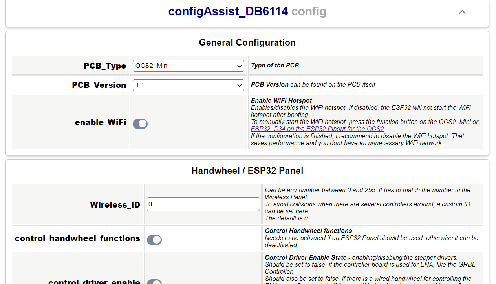

# OPEN-CNC-Shield 2.x ESP32 Software

This project contains the software for the ESP32 on the OPEN-CNC-Shield 2.

## Howto install - Web flasher
Visit the [Firmware installer page](https://timo1235.github.io/ocs2.x-esp32-software/) and follow the steps. No compiling etc required.

## Howto install - VSCode - old way

Open this project folder in VS Code with PlatformIO IDE and upload it to the ESP32. A good documentation how to get the IDE up and running can be found here:
[Getting Started with VS Code and PlatformIO IDE](https://randomnerdtutorials.com/vs-code-platformio-ide-esp32-esp8266-arduino/).
The corresponding ESP32 software for the remote control can be found here: [OPEN-CNC-Shield 2.x ESP32 Panel Software](https://github.com/timo1235/-ocs2.x-esp32-panel-software-).

### Configuration

The device can be configured using the webinterface. See the [Firmware installer page](https://timo1235.github.io/ocs2.x-esp32-software/) for more information.

#### Manually start the configuration webinterface
- OPEN-CNC-Shield 2: Connect a wire between GND and `ESP32_D34`, see [ESP32 Pinout](https://docs.timos-werkstatt.de/open-cnc-shield-2/mainboard/anschluesse-jumper#esp32-pinout). 
Then the WiFi hotspot should start and the wire can be disconnected again.
- OPEN-CNC-Shhield 2 Mini: Use the function button on the board. Then the WiFi hotspot should start.

## Features implemented

- control the dac chip(analog outputs like joystck x....)
- control the two PCA9555 chips (I/O port expander)
- establish a Wifi connection to a handwheel and control the I/Os accordingly
- autosquaring process
- WiFi handling with several clients
- Serial communication with the ESP32 panel if the panelmodule RJ45 is connected and the esp32 panel is connected with an RJ45 cable
- Serial connection has higher priority than WiFi connection

## Safety implementations

- Outputs are resettet if WiFi handwheel is not responding for some milliseconds
- Autosquaring only starts after pressing the button for some time
- Ignore requests from multiple ESP32 if they try to control the same Ouput - for example a joystick

# Changelog

## latest
## 1.1.4
- Fix max config entries value

## 1.1.3
- Added support for OCS2 Mini v1.3
- Bumped dependencies

## 1.1.2
- Improved connection check to I2C und SPI chips
  - restore connection periodically if it was lost

## 1.1.1
- Added PCB version 1.2 for OCS2 mini

## 1.1.0
- Some refactorings and optimizations
- Added OCS2 Mini support
- Completely refactored configuration
  - Added webinterface for configuration

## 1.0.7
- Added experimental functionality for fluidnc jogging with the wireless handwheel
  - Needs to be activated in the `configuration.h`
  - Also jumper wires are needed to be able to establish a UART connection to FluidNC
  - See [Blog](https://blog.altholtmann.com/fluidnc-jogging-mit-wireless-handrad/) for more information

## 1.0.6

- Fixed a bug with the motor direction when the ESP32 is plugged in to the OCS2
  - changing the direction was not possible while the esp32 was plugged in

## 1.0.5

- Fix timeouts because of wrong delay in wifi tasks, this should fix behavior when autosquaring is started via the pinout instead of an wifi panel

## 1.0.4

- Small fix for the control of the DIR pins

## 1.0.3

- Added support for the OPEN-CNC-Shield v2.13

## 1.0.2

- Used esp32 pin d27 for the dir buffer of the controller module
  - When autosquaring is active, the dir buffer is disabled, so the controller module cant set the direction of the motors
  - When autosquaring is finished, the dir buffer is enabled again
- Added package.json
- Used esp32 pin d32 for the dac multiplexer enable pin
  - When `ESP_HANDWHEEL` is on, the dac multiplexer is enabled, so the esp32 handwheel can control the analog outputs
  - When `ESP_HANDWHEEL` is off, the dac multiplexer is disabled, a wired handwheel can then control the analog outputs like joystick etc. For example with the PanelModule Breakout

## 1.0.1

- removed the configuration variable "DRIVE_FROM_ENDSTOP_AFTER_AUTOSQUARE" since this can now be controlled individually for every motor
- added configuration for every autosquare motor to define the drive back distance after autosquaring
- added `Serial Transfer` library
- added code for serial communication with the ESP32 panel
- added new configuration `RESET_FEEDRATE_AND_ROTATION_SPEED_ON_CONNCTION_LOSS` to control the communication loss reset behavior
  - changed default behaviour of sketch to not reset feedrate and rotation speed on connection loss (this can have a negative effect on the machine if the connection is lost for a short time and a job is running)

## 1.0.0

- inital version
